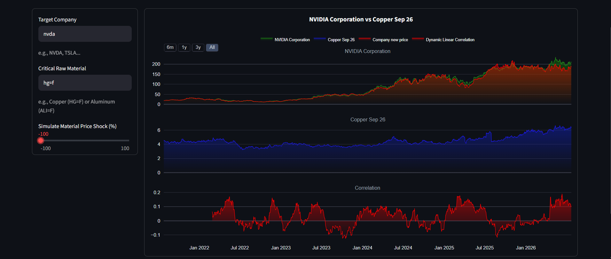

# 📈 What-if Scenario Simulator for CEOs

A data science project that simulates how changes in raw material prices could hypothetically influence a company's stock price using historical market data.

🌐 **Live App:** https://supply-chain-dashboard-mscacf99pl9rtcv7pu2ndm.streamlit.app/



> **Disclaimer**
>
> This project is an educational simulation built to practice data science concepts. It is **not** a financial forecasting or investment tool.

---

## Overview

Business leaders constantly face uncertainty regarding fluctuations in raw material prices. This project explores a simple **"what-if" scenario**:

> *If the price of a key material changes by **N%**, how might the company's stock price react based on historical relationships?*

Instead of attempting to predict the future, the application uses historical market data and statistical correlation to simulate a possible outcome.

This project was built as a summer data science exercise to strengthen practical Python skills and gain hands-on experience with data analysis and visualization.

---

## Features

- 📊 Retrieve **5 years** of historical stock price data using Yahoo Finance
- 🏭 Simulate changes in raw material prices
- 📈 Calculate a **dynamic Pearson correlation** between material prices and company stock prices
- ⏳ Apply a configurable **90-day business lag** to better reflect delayed market effects
- 📉 Visualize both historical and simulated price movements with interactive Plotly charts
- 🌐 Run entirely through an interactive Streamlit dashboard

---

## How It Works

The application follows these steps:

1. Download five years of historical stock price data from Yahoo Finance's servers.
2. Receive the user's estimated percentage change in a raw material price.
3. Calculate the rolling Pearson correlation between the material and the selected company's stock.
4. Apply the material price shock with a **90-day business quarter lag**.
5. Generate a simulated stock price scenario.
6. Display the historical and simulated results through an interactive Streamlit dashboard.

---

## Tech Stack

### Language

- Python

### Libraries

- Pandas
- Plotly
- yfinance
- Streamlit

---

## Installation

Clone the repository:

```bash
git clone https://github.com/Mamma-D/what-if-scenario-for-ceos.git
```

Install the required packages:

```bash
pip install -r requirements.txt
```

Run the application locally:

```bash
streamlit run dashboard.py
```

---

## Project Structure

```
.
├── dashboard.py      # Streamlit frontend
├── summer.py         # Core simulation engine
├── requirements.txt
├──README.md
└── images/
    └── screenshot.png
```

---

## Methodology

The project combines several concepts commonly used in data science:

- Data acquisition through APIs
- Data cleaning and manipulation with Pandas
- Time-series analysis
- Rolling Pearson correlation
- Scenario simulation
- Interactive visualization

The simulated stock price is generated by applying a hypothetical material price change while incorporating a business-quarter lag to represent delayed market reactions.

---

## What I Learned

This project significantly improved my understanding of practical data science development.

Some of the skills I developed include:

- Working with external APIs using `yfinance`
- Advanced data manipulation and handeling missing datas with Pandas
- Building interactive dashboards using Streamlit
- Creating professional interactive visualizations with Plotly
- Organizing Python code into reusable modules
- Applying statistical concepts such as Pearson correlation to real financial data

Most importantly, this project helped transform theoretical knowledge into a complete, deployable application suitable for a portfolio.

---

## Limitations

This project is intentionally simple and should be viewed as an educational demonstration.

Current limitations include:

- Correlation does **not** imply causation.
- The simulation assumes historical relationships remain consistent.
- Only one material-company relationship is modeled at a time.
- No macroeconomic variables are included.
- This is **not** intended for investment decisions.

---

## Future Work

Although no further development is currently planned, possible improvements include:

- Multiple material inputs
- More advanced statistical models
- Machine learning–based scenario generation
- Sensitivity analysis
- Better parameter calibration

---

## License

This project is licensed under the MIT License.

---

## Author

This is just a summer project to move my head around data science fundamentals, so i appreciate any suggestions or ciritcs about anything. Looking forward to hear your experiences!

**Mohammad Gheybi**

Industrial Engineering Student | Aspiring Data Scientist

GitHub: https://github.com/Mamma-D
